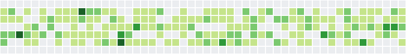

# Contributions Calendar

Create a page that displays a contributions calendar such as the one on [GitHub profile](https://github.com/LeaVerou) pages. The result should look like this:



As a data source use [timestamps.json](./timestamps.json), which contains a sorted array of timestamps, one per contribution.

Each column of the graph represents one week, and starts on Sunday. The graph should display 52 full weeks, starting on `2019-01-06 00:00:00 UTC` (Sunday). You don't need to display labels for months and days of the week. The size and spacing of squares is up to you.

Each square should be colored according to the number of contributions on that date relative to the highest number of contributions on a single day in the displayed range.

<table>
    <tr>
        <th>Number of Contributions</th>
        <th>Color</th>
    </tr>
    <tr><td>   0        </td> <td>#ebedf0</td></tr>
    <tr><td>>  0% of max</td> <td>#c6e48b</td></tr>
    <tr><td>> 25% of max</td><td>#7bc96f</td></tr>
    <tr><td>> 50% of max</td><td>#239a3b</td></tr>
    <tr><td>> 75% of max</td><td>#196127</td></tr>
</table>

Each square should have a tooltip with the number of contributions on that date. You can use the native `title` attribute.

# Implementation Notes
* Use technology you're comfortable with, whether it's vanilla JS and CSS, TypeScript, a library such as React or Vue, a boilerplate, or an online playground such as [CodeSandbox](https://codesandbox.io/).
* We'd like you to implement graph drawing on your own rather than use an existing library such as D3 to demonstrate your knowledge of CSS and HTML.
* We expect your code to be tidy, readable and reasonably modular, but don't try to make it as generic and reusable as possible.
* Don't worry about compatibility with older browsers. Feel free to use the latest CSS and JavaScript features.
* We don't expect you to add documentation or comments.
* Assume that the input data is valid, you don't need to validate it.
* We don't expect you to write tests, but let's discuss afterwards what tests could be added.

# Date Arithmetic
You can use a library such as [Moment](https://momentjs.com/docs/) or the native `Date` object. You can also rely on the fact that in JavaScript there are no leap seconds, and a day is always 86,400,000 milliseconds long. This allows you to convert all dates to milliseconds from the get go, and do all arithmetic on numbers instead of dates.

```js
const millis = new Date('2019-01-06T00:00:00.000Z').getTime();
```
