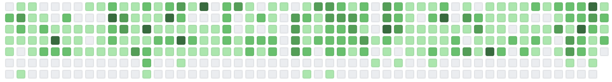

# Contributions Calendar

Create a page that displays a contributions calendar such as the one on [GitHub profile](https://github.com/LeaVerou) pages. This type of graph is called calendar heatmap.

As a data source use [timestamps.json](./timestamps.json), which contains a sorted array of timestamps, one timestamp per contribution.

Each column of the graph represents one week, and starts on Sunday. The graph should display exactly 52 full weeks, starting on `2019-01-06 00:00:00 UTC` (Sunday). You don't need to display labels, just the grid. The size and spacing of grid squares is up to you.

Each square should be colored according to the number of contributions on that date relative to the highest number of contributions on a single day in the displayed range.

<table>
    <tr>
        <th>Number of Contributions</th>
        <th>Color</th>
    </tr>
    <tr><td>   0        </td> <td>#ebedf0</td></tr>
    <tr><td>>  0% of max</td> <td>#c6e48b</td></tr>
    <tr><td>> 25% of max</td><td>#7bc96f</td></tr>
    <tr><td>> 50% of max</td><td>#239a3b</td></tr>
    <tr><td>> 75% of max</td><td>#196127</td></tr>
</table>

Each square should show a tooltip on hover with the number of contributions on that date. Use the native `title` attribute.

# Implementation Notes
* It's up to you whether to use vanilla JS and CSS, TypeScript, a library such as React or Vue, a boilerplate, or an online playground such as [CodeSandbox](https://codesandbox.io/).
* Implement data aggregation and graph layout on your own rather than use existing libraries such as Lodash and D3.
* We expect your code to be tidy, readable and reasonably modular, but don't try to make it as generic and reusable as possible.
* Don't worry about compatibility with older browsers. Feel free to use latest browser APIs and JS features.
* For date arithmetic you can either use the native `Date` object or a library such as [Moment](https://momentjs.com/docs/). If you decide to go with the native Date object, this [cheatsheet](./DATE_CHEATSHEET.md) might be helpful.
* Documenting function signatures is not required.
* Assume that the input data is valid, you don't need to validate it.
* We don't expect you to write tests, but let's talk about them afterwards.
